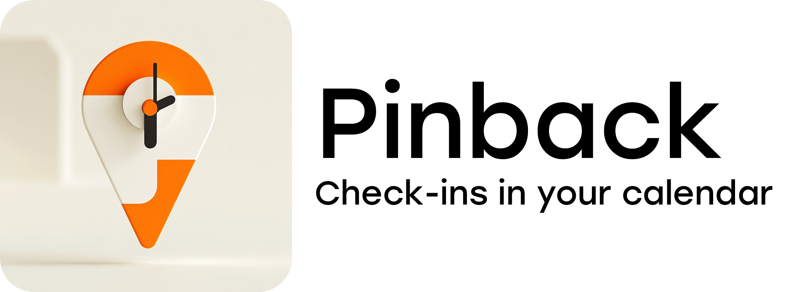

<p>
    
</p>

<p>
    
</p>

This app does the following...
1. Fetches check-in data from Swarm API
2. Converts to iCalendar format
3. Uploads to AWS S3

You then can subscribe to these hosted calendar files in your calendar app of choice. To keep data fresh, run it daily.

## How to run with your own data

You'll need to do the following:
1. Get a Foursquare Oauth token for your user.
2. Save the calendar files to AWS S3.
3. Host this app and schedule it to run daily.

Expected setup time: 15-30 minutes<br />
Required cost: A few cents per month for hosting

### 1. Get a Foursquare Oauth token 🪙

Before we get going, run `npm i` to install dependencies.

You can utilize the Foursquare API with an API key that is generated via the developer portal, but for certain data, including user check-ins, you'll need to use OAuth.

This process is cumbersome, but you only have to do it once.

1. Go to https://foursquare.com/developers/. Create a new developer account if you don't have one.
2. Create a new project in their developer portal.
3. In the *Project Settings*, enter http://www.google.com in the Redirect URL field. Take note that your Client ID and Client Secret are listed just above.
4. In your browser, navigate to the following URL:
```shell
https://foursquare.com/oauth2/authenticate
?client_id=YOUR_CLIENT_ID
&response_type=code
&redirect_uri=YOUR_REDIRECT_URI
```
5. Approve the app.
6. You'll be redirected to Google with a URL like `http://www.google.com/?code=YOUR_CODE`. Copy this code value - you'll need it in the next step. Important: If there's a `#` symbol and additional characters after the code, don't include those. The code should only contain letters and numbers.
7. Run the following curl command to get the Oauth token:
```shell
curl -X POST "https://foursquare.com/oauth2/access_token" \
  -d "client_id=YOUR_CLIENT_ID" \
  -d "client_secret=YOUR_CLIENT_SECRET" \
  -d "grant_type=authorization_code" \
  -d "redirect_uri=YOUR_REDIRECT_URI" \
  -d "code=CODE_RECEIVED_FROM_REDIRECT"
```
8. The response should include your access token.
9. Rename `.env.example` file to `.env` and populate `FOURSQUARE_OAUTH_TOKEN` with your access token.

#### Fetch check-in data and convert to iCalendar format 📅

1. Run `npm run fetch`. This should fetch the data and store in `checkins.json`.
2. Run `npm run ical`. This converts the check-in data to iCalendar format.

You should see one or more `calendar-xxxx-xxxx.ics` files in your project folder.

> [!NOTE]
> Rather than a single ICS file for all check-ins, we create multiple files for each 5-year period. This is to avoid hitting a possible 1MB file limit for subscribed calendars in Google Calendar -- the documentation on this is fuzzy. You will need to subscribe to each of the files individually in your calendar app.

### 2. Save the calendar files to AWS S3 🪣 

1. Login to [AWS](https://aws.amazon.com/s3/) and click create a new S3 bucket. 
2. **Important:** Uncheck "Block all public access" and acknowledge the security warning
3. Add these values to your `.env` file:
```ini
AWS_ACCESS_KEY_ID=       # From top-right menu > Security Credentials > Access keys
AWS_SECRET_ACCESS_KEY=   # From top-right menu > Security Credentials > Access keys
AWS_REGION=              # Example: us-west-1
S3_BUCKET_NAME=          # Your bucket name
```
4. Configure bucket permissions:
   - Go to bucket's Permissions tab
   - Edit bucket policy
   - Paste and update the following, update :
```json
{
    "Version": "2012-10-17",
    "Statement": [
        {
            "Effect": "Allow",
            "Principal": "*",
            "Action": "s3:GetObject",
            "Resource": "arn:aws:s3:::BUCKET_NAME/*"
        }
    ]
}
```

#### 📍 Fetch check-in data and convert to iCalendar format

Run `npm run upload-all`. This will upload all of the calendar files to your S3 bucket.

Confirm that the files are in the bucket via the AWS console. Go ahead and subscribe to the calendars in your calendar app of choice.

### 3. 🌄 Host this app and schedule it to run daily

We'll use Render.com for hosting. Cost should be a few cents per month.

1. Create an account on [Render](https://render.com/).
2. Create a new project of type Cron Job.
3. Connect your Github repo.
4. Configure the job:
   ```
   Schedule: 0 0 * * *     # Runs daily at midnight UTC
   Build: npm install
   Command: npm run start
   ```
5. Add environment variables from your `.env` file
6. Deploy and test with "Trigger Run"

Confirm that the files in the AWS S3 bucket were updated.

### Troubleshooting

Common issues:
- Calendar not updating? Most apps refresh only every 24-48 hours
- Build failing? Check Render logs for details
- Files not public? Double-check S3 bucket permissions
- Rate limits? Ensure your Foursquare OAuth token is valid


### Local Development

To test locally:
```bash
npm run fetch    # Get check-ins
npm run ical     # Convert to calendar format
npm run upload   # Test S3 upload
```

## To-do
- [ ] Remove hardcoded 2005 start year. Use first check-in date from API.
- [ ] Ditch file saving. Upload directly to S3.