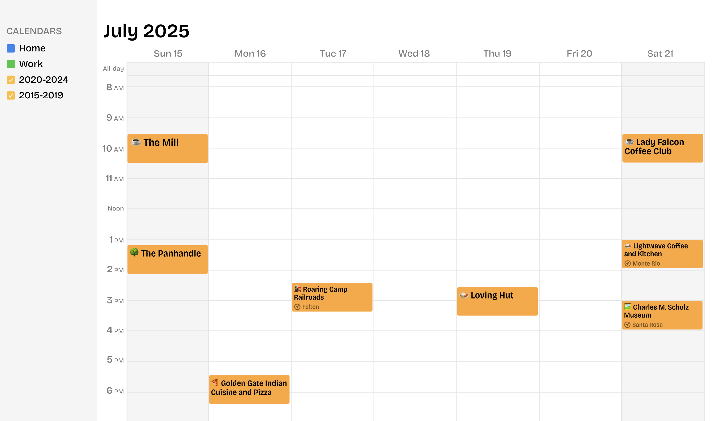

<p>
    
</p>

<p>
    
</p>

[](https://github.com/lokesh/pinback/actions/workflows/daily.yaml)

This app does the following...
1. Fetches your check-in data from Foursquare/Swarm API
2. Converts to iCalendar format
3. Uploads to AWS S3
4. Updates the calendar files regularly via GitHub Actions cronjob

You then can subscribe to these hosted calendar files in your calendar app of choice.

## Prerequisites
- Node.js v22 or higher
- A Foursquare/Swarm account with check-ins
- AWS account (free tier works fine)
- GitHub account

## How to run with your own data

We'll need to do the following:
1. Get a Foursquare Oauth token for your user.
2. Save the calendar files to AWS S3.
3. Schedule the app to run regularly via GitHub Actions cronjob

Expected setup time: 15-30 minutes

### 1. Get a Foursquare Oauth token 🪙

Before we get going, run `npm i` to install dependencies.

You can utilize the Foursquare API with an API key that is generated with a single-click via the developer portal, but for certain data, including user check-ins, you'll need to use OAuth. This process is cumbersome, but you only have to do it once.

1. Go to https://foursquare.com/developers/. Create a new developer account if you don't have one.
2. Create a new project in their developer portal.
3. In the *Project Settings*, enter http://www.google.com in the Redirect URL field. Take note that your Client ID and Client Secret are listed just above.
4. In your browser, navigate to the following URL:
```shell
https://foursquare.com/oauth2/authenticate?client_id=YOUR_CLIENT_ID&response_type=code&redirect_uri=YOUR_REDIRECT_URI
```
5. Approve the app.
6. You'll be redirected to Google with a URL like `http://www.google.com/?code=YOUR_CODE`. Copy this code value - you'll need it in the next step. Important: If there's a `#` symbol and additional characters after the code, don't include those. The code should only contain letters and numbers.
7. Run the following curl command to get the Oauth token:
```shell
curl -X POST "https://foursquare.com/oauth2/access_token" \
  -d "client_id=YOUR_CLIENT_ID" \
  -d "client_secret=YOUR_CLIENT_SECRET" \
  -d "grant_type=authorization_code" \
  -d "redirect_uri=YOUR_REDIRECT_URI" \
  -d "code=CODE_RECEIVED_FROM_REDIRECT"
```
8. The response should include your access token.
9. Rename `.env.example` file to `.env` and populate `FOURSQUARE_OAUTH_TOKEN` with your access token.

Open up `config.js` and update the settings to your liking and then run `npm run start` to test the fetching and calendar generation.

**Configuration Options**
- `myCity`: Your home city (used to simplify location display)
- `myCountry`: Your home country (used for international vs domestic formatting)
- `eventDurationInMinutes`: How long each check-in event should appear (default: 60)
- `defaultIcon`: Fallback emoji for uncategorized venues (default: 📍)

> [!NOTE]
> Rather than a single ICS file for all check-ins, we create multiple files for each 5-year period. This is to avoid hitting a possible 1MB file limit for subscribed calendars in Google Calendar -- the documentation on this is fuzzy. You will need to subscribe to each of the files individually in your calendar app.


### 2. Save the calendar files to AWS S3 🪣 

1. Login to [AWS](https://aws.amazon.com/s3/) and click create a new S3 bucket. 
2. **Important:** Uncheck "Block all public access" and acknowledge the security warning
3. Add these values to your `.env` file:
```ini
AWS_ACCESS_KEY_ID=       # From top-right menu > Security Credentials > Access keys
AWS_SECRET_ACCESS_KEY=   # From top-right menu > Security Credentials > Access keys
AWS_REGION=              # Example: us-west-1
S3_BUCKET_NAME=          # Your bucket name
```
4. Configure bucket permissions:
   - Go to bucket's Permissions tab
   - Edit bucket policy
   - Paste and update the following, update :
```json
{
    "Version": "2012-10-17",
    "Statement": [
        {
            "Effect": "Allow",
            "Principal": "*",
            "Action": "s3:GetObject",
            "Resource": "arn:aws:s3:::BUCKET_NAME/*"
        }
    ]
}
```

Run `npm run start` again, this time it should not only fetch the check-ins and generate the calendar files, but also upload them to S3.

Confirm that the files are in the bucket via the AWS console. Go ahead and subscribe to the calendars in your calendar app of choice.

### 3. 🤖 Set up GitHub Actions to run daily

Rather than running running this app manually we'll use GitHub Actions to run the app daily for us.

1. Fork this repository to your GitHub account.

2. Add your environment variables as repository secrets:
   - Go to your repository's Settings
   - Click on "Secrets and variables" → "Actions"
   - Click "New repository secret"
   - Add each of these secrets from your `.env` file:
     - `AWS_ACCESS_KEY_ID`
     - `AWS_SECRET_ACCESS_KEY`
     - `AWS_REGION`
     - `S3_BUCKET_NAME`
     - `FOURSQUARE_OAUTH_TOKEN`
     - `FOURSQUARE_API_VERSION`

The GitHub Action is already configured in `.github/workflows/daily.yaml` to run daily at midnight UTC. You can view the runs under the "Actions" tab in your repository.

To test the setup:
1. Go to the "Actions" tab in your repository
2. Select the "Daily Update" workflow
3. Click "Run workflow"
4. Check the run logs to ensure everything worked
5. Verify that the files in your S3 bucket were updated

### Troubleshooting

Common issues:
- Calendar not updating? Most apps refresh only every 24-48 hours
- GitHub Action failing? Check the Actions tab for error logs
- Files not public? Double-check S3 bucket permissions


### To-do

- [ ] Use Ora progress indicator
- [ ] Simplify OAuth flow with helper script

